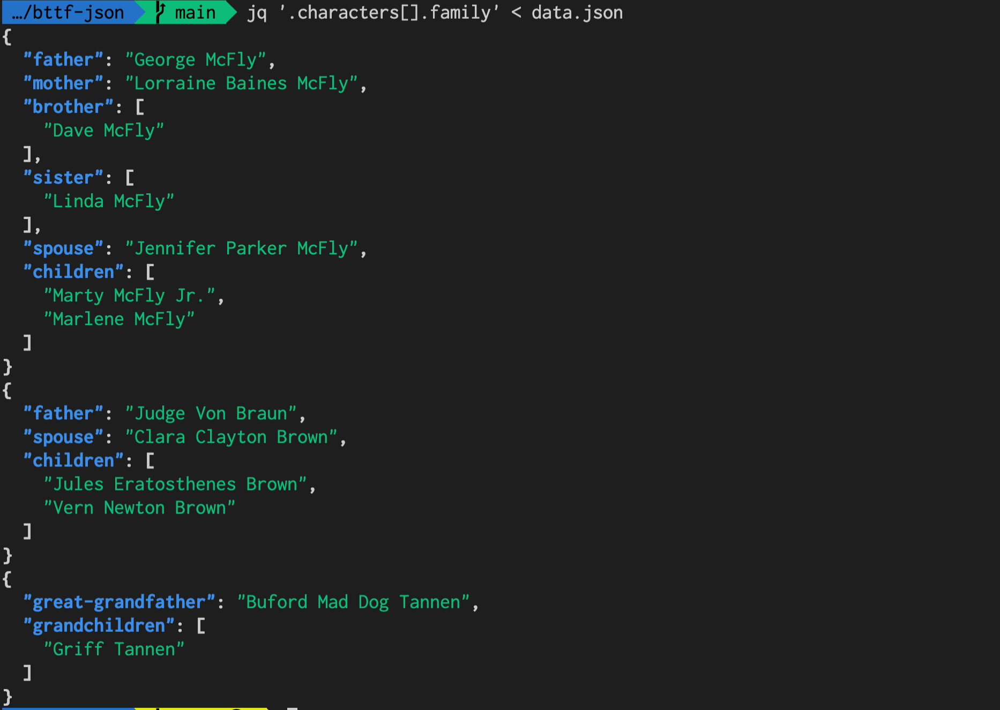

# bttf-json

"Back To The Future" JSON.

Just includes one data.json.

## How to use

- `jq`

```sh
jq '.characters[].family' < data.json # or jq '.characters[*].family'
```



## Reference

Inspired by [SWAPI](https://swapi.dev/).

Data collected from Wikipedia 
- https://en.wikipedia.org/wiki/Marty_McFly
- https://en.wikipedia.org/wiki/Emmett_Brown
- https://en.wikipedia.org/wiki/Biff_Tannen